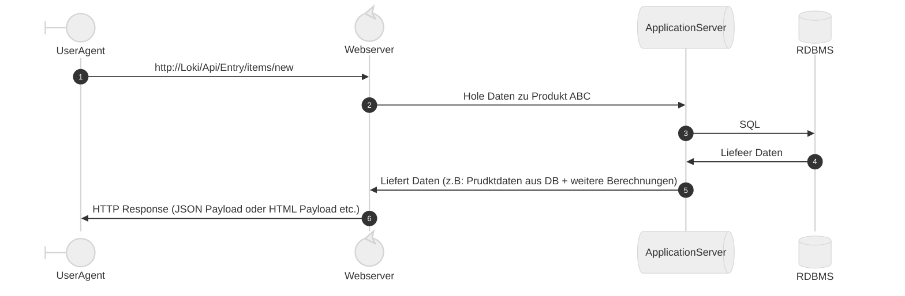

# Multi Tier Architektur 

## Client-Server Model

```mermaid
---
config:
  look: handDrawn
  theme: neutral
---
sequenceDiagram
autonumber
    participant UserAgent@{ "type" : "boundary"}
    participant Webserver@{ "type" : "control" }
    participant ApplicationServer@{ "type" : "queue" }
    participant RDBMS@{ "type" : "database" }
    UserAgent->>Webserver: http://Loki/Api/Entry/items/new 
    Webserver->>ApplicationServer: Hole Daten zu Produkt ABC
    ApplicationServer->>RDBMS:SQL
    RDBMS->>ApplicationServer:Liefeer Daten
    ApplicationServer->>Webserver: Liefert Daten (z.B: Prudktdaten aus DB + weitere Berechnungen)
    Webserver->>UserAgent: HTTP Response (JSON Payload oder HTML Payload etc.)
    
```
