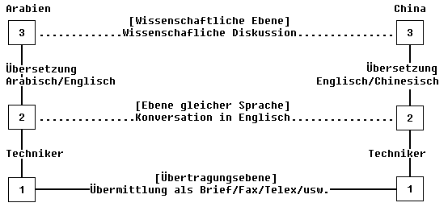
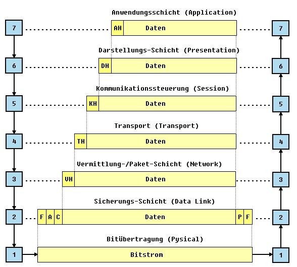

# Client-Server-Modell

Eine grundlegende Netzwerkarchitektur bei welcher ein Client (Device oder Programm) eine <var>Request</var> genannte Anfrage an einen <var>Server</var> (aka <var>Service provider</var>) sendet, um Zugriff auf eine Ressource zu erhalten.

## Schichtenmodelle

### ISO/OSI 

## Appendix

## Externe Referenzen

- https://de.wikipedia.org/wiki/OSI-Modell

