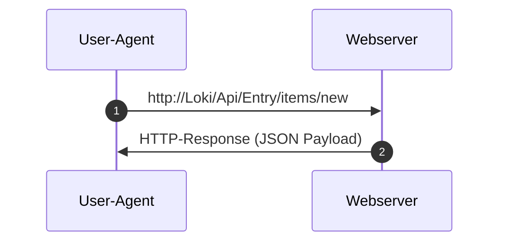

# HTTP[^1]

## Client-Server Kommunikation

- HTTP folgt dem Client-Server-Modell. Im Kontext von HTTP spricht man bei Anfragen <var>(Request)</var> und Antworten <var>(Response)</var> von <var>Message</var>
- HTTP-<var>Requests</var>s benutzen sog. <var>[Methoden](#_methods)</var> (diese werden manchmal auch als „Verb“ bezeichnet)
- HTTP benutzt <var>TCP</var> oder <var>UDP</var> zum [Transport](../transport.md)
- HTTP ist <var>zustandslos</var>





### Kommunikation

- HTTP-<var>Connect</var> zu <kbd>Loki</kbd> (IP:```192.168.2.23```) auf Port ```80``` (default) oder:


- HTTPS-<var>Connect</var> zu <kbd>Loki</kbd> (IP:```192.168.2.23```) auf Port ```443``` (default bei ```TCP```) oder:
- HTTPS-<var>Connect</var> zu <kbd>Loki</kbd> (IP:```192.168.2.23```) auf Port ```488``` (default bei ```UDP```) oder:

- <var>Connect</var> zu <kbd>Loki:__4711__</kbd> (IP:```192.168.2.23```) auf Port <b>```4711```</b>

## HTTP Beispiel Request Message ()
Oben: Header Zeile(n)

<kbd title="Carriage Return">CR</kbd>+<kbd title="LineFeed">LF</kbd>+<kbd title="Carriage Return">CR</kbd>+<kbd title="LineFeed">LF</kbd> aka ```\r\n\r\n```

Unten: <var>Payload</var>


```
POST /Loki/Api/Entry/items/new HTTP/1.1
Host: Loki
User-Agent: MyPyUA/0.2342666
Accept: application/json
Content-type: application/x-www-form-urlencoded
Content-length: 33
Connection: close
```
```      
Name=Pan+Pever&Location=N3v3ᴙL@nD
```


## HTTP Example Response Header

Oben: Header Zeile(n)

<kbd title="Carriage Return">CR</kbd>+<kbd title="LineFeed">LF</kbd>+<kbd title="Carriage Return">CR</kbd>+<kbd title="LineFeed">LF</kbd> aka ```\r\n\r\n```

Unten: <var>Payload</var>

```
HTTP/1.1 201 Created
Location: http://Loki/Api/Entry/items/new
Cache-Control: no-cache
Server: Pythonista Club DE-47445 aka Ütfor(t)
Date: Wed Jul 4 15:31:53 2012
Connection: Keep-Alive
Content-Type: application/json;charset=UTF-8
Content-Length: 115
```
```json
{
	"NewEntry":	{
		"AffectedRows": 1,  
		"NewID": "23425%3F00B@ᴙ",
		"LogUri": "http://Loki/Api/Entry/log/foo
	}
}
```
## HTTP Message (allgemein)

```
{STATUS ZEILE}
{HEADER_001}: WERT 1
{HEADER_002}: WERT 2
    ...
{HEADER_00{N}}: WERT N    
```
```
{PAYLOAD}
```

## HTTP Request Message (allgemein)

```
{METHOD} /REL_PATH_URI/FOO HTTP/{VERSION}
{HEADER_001}: WERT 1
    ...
{HEADER_00{N}}: WERT N    
```
```
{PAYLOAD} <opt>
```

## HTTP Response Message (allgemein)

```
{METHOD} /REL_PATH_URI/FOO HTTP/{VERSION}
{HEADER_001}: WERT 1
    ...
{HEADER_00{N}}: WERT N    
```
```
{PAYLOAD} <opt>
```


### <a name="_methods">Methods</a>

#### GET:

[S.a](GET/wiki/HTTP/Anfragemethoden#GET) 

#### POST

#### HEAD

#### PUT

####  PATCH

#### DELETE

#### TRACE

#### OPTIONS

#### CONNECT


[^1]: hier: synonym für HTTP und HTTPs

### Appendix:

The <var>HTTP Content-Length</var> header indicates the size, in bytes, of the message __body__ sent to the recipient.
SEE: https://developer.mozilla.org/en-US/docs/Web/HTTP/Reference/Headers/Content-Length