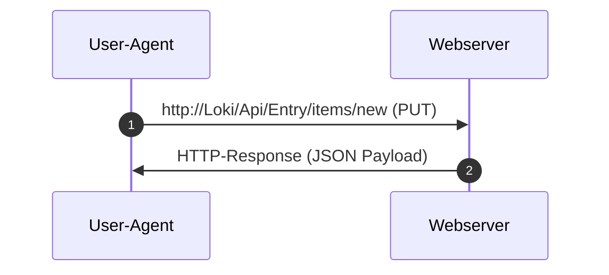

# HTTP[^1]

## Client-Server Kommunikation


Beispiel einer HTTP-Kommunikation per ```PUT``` - Empfang einer Antwort als ```JSON```
:
- HTTP folgt dem Client-Server-Modell. Im Kontext von HTTP spricht man bei Anfragen <var>(Request)</var> und Antworten <var>(Response)</var> von <var>Message</var>
- HTTP-<var>Requests</var>s benutzen sog. <var>[Methoden](#_methods)</var> (diese werden manchmal auch als „Verb“ bezeichnet)
- HTTP benutzt <var>TCP</var> oder <var>UDP</var> zum [Transport](../transport.md)
- HTTP ist <var>zustandslos</var>





### Kommunikation

Annahme: der Host <var>Loki</var> wird im lokalen Netz aufgelöst zu der (Legacy) IP-Adresse <kbd>192.168.2.23</kbd>


- HTTP-<var>Connect</var> zu <kbd>Loki</kbd> (IP:```192.168.2.23```) auf Port ```80``` (default) oder:


- HTTPS-<var>Connect</var> zu <kbd>Loki</kbd> (IP:```192.168.2.23```) auf Port ```443``` (default bei ```TCP```) oder:
- HTTPS-<var>Connect</var> zu <kbd>Loki</kbd> (IP:```192.168.2.23```) auf Port ```488``` (default bei ```UDP```) oder:

- HTTP*-<var>Connect</var> zu <kbd>Loki:__4711__</kbd> (IP:```192.168.2.23```) auf Port <b>```4711```</b>

## HTTP Beispiel Request Message ()
Oben: Header Zeile(n)

<kbd title="Carriage Return">CR</kbd>+<kbd title="LineFeed">LF</kbd>+<kbd title="Carriage Return">CR</kbd>+<kbd title="LineFeed">LF</kbd> aka ```\r\n\r\n```

Unten: <var>Payload</var>


```
POST /Api/Entry/items/new HTTP/1.1
Host: Loki
User-Agent: MyPyUA/0.2342666
Accept: application/json
Content-type: application/x-www-form-urlencoded
Content-length: 33
Connection: close
```
```      
Name=Pan+Pever&Location=N3v3ᴙL@nD
```


## HTTP Example Response Header

Oben: Header Zeile(n)

<kbd title="Carriage Return">CR</kbd>+<kbd title="LineFeed">LF</kbd>+<kbd title="Carriage Return">CR</kbd>+<kbd title="LineFeed">LF</kbd> aka ```\r\n\r\n```

Unten: <var>Payload</var>

```
HTTP/1.1 201 Created
Cache-Control: no-cache
Server: Loki (Pythonista Club DE-47445 aka Ütfor(t))
Date: Wed Jul 4 15:31:53 2012
Connection: Keep-Alive
Content-Type: application/json;charset=UTF-8
Content-Length: 115
```
```json
{
	"NewEntry":	{
		"AffectedRows": 1,  
		"NewID": "23425%3F00B@ᴙ",
		"LogUri": "http://Loki/Api/Entry/log/foo"
	}
}
```
## HTTP Message (allgemein)

```
{REQUEST ZEILE} || {STATUS ZEILE}
{HEADER_001}: WERT 1
{HEADER_002}: WERT 2
    ...
{HEADER_00{N}}: WERT N    
```
```
{PAYLOAD}
```

## HTTP Request Message (allgemein)

```
{METHOD} /REL_PATH_URI/FOO HTTP/{VERSION}
{HEADER_001}: WERT 1
    ...
{HEADER_00{N}}: WERT N    
```
```
{PAYLOAD} <opt>
```

## HTTP Response Message (allgemein)

```
{METHOD} /REL_PATH_URI/FOO HTTP/{VERSION}
{HEADER_001}: WERT 1
    ...
{HEADER_00{N}}: WERT N    
```
```
{PAYLOAD} <opt>
```


### <a name="_methods">Methods</a>

#### Idempotenz 

Eine ```HTTP```-Methode ist <var>idempotent</var>, wenn die beabsichtigte Wirkung auf den Server bei einer einzelnen Anfrage dieselbe ist wie die Wirkung bei mehreren identischen Anfragen.

Die Methode <var>POST</var> ist <u>nicht</u> <var>idempotent</var>, sondern sorgt für die Anlage einer neuen Ressource auf dem Server

```GET /Api/Entry/items/112 HTTP/1.1``` ist idempotent, da es sich um eine sichere (nur lesbare) Methode handelt. Nachfolgende Aufrufe können unterschiedliche Daten an den Client zurückgeben, wenn die Daten auf dem Server in der Zwischenzeit aktualisiert wurden.

```POST /Api/Entry/items/new HTTP/1.1``` ist nicht idempotent; wenn es mehrmals aufgerufen wird, fügt es mehrere Zeilen hinzu:


```POST /Api/Entry/items/new HTTP/1.1```   -> Neue Ressource
```POST /Api/Entry/items/ HTTP/1.1```   -> 2. neue Ressource
```POST /Api/Entry/items/HTTP/1.1```   -> 3. neue Ressource

```DELETE /Api/Entry/items/42/delete HTTP/1.1``` ist idempotent, auch wenn der zurückgegebene Statuscode zwischen den Anfragen variieren kann:
```DELETE /Api/Entry/items/42/delete HTTP/1.1```   ->  200 falls Ressource existiert
```DELETE /Api/Entry/items/42/delete HTTP/1.1```   -> 404 falls Ressource nicht existiert 

#### GET:

[S.a](GET/wiki/HTTP/Anfragemethoden#GET) 

Erklärung folgt: __Wichtig__ --> <i>idempotent</i>

#### POST

Erklärung folgt: __Wichtig__ --> <u>nicht</u> <i>idempotent</i>

#### HEAD

Erklärung folgt: __Wichtig__ --> <i>idempotent</i>

#### PUT

Erklärung folgt: __Wichtig__ --> <i>idempotent</i>

####  PATCH

Erklärung folgt: __Wichtig__ --> <i>idempotent</i>

#### DELETE

Erklärung folgt: __Wichtig__ --> <i>idempotent</i>

#### TRACE

Erklärung folgt: __Wichtig__ --> <i>idempotent</i>

#### OPTIONS
Erklärung folgt: __Wichtig__ --> <i>idempotent</i>

#### CONNECT

Erklärung folgt: __Wichtig__ --> <i>idempotent</i>

## Übertragen von Daten / Information

### HTTP Parameter

Neben der Möglichkeit, Metainformationen per HTTP- Header zu übertragen, existieren sog. Parameter, als Schlüssel-Wert-Paare
(```key=val```) zu senden:

1. Per URI (getrennt durch "?") ```https://loki/API/Foo?key=val```
2. Als Payload ```key=val```

Mehrer <var>Key-Value<-Pairs<var> werden durch ein <var>Ampersand</var>(```&```) verknüft:
```name=Sven&location=DE&id=2305```

#### Codierung von Parametern

### Andere Wege der Datenmübertragung als Payload

#### JSON

### Sonstiges
    - XML
    - SOAP
    - Andereres


[^1]: hier: synonym für HTTP und HTTPs

### Appendix:

The <var>HTTP Content-Length</var> header indicates the size, in bytes, of the message __body__ sent to the recipient.
SEE: https://developer.mozilla.org/en-US/docs/Web/HTTP/Reference/Headers/Content-Length