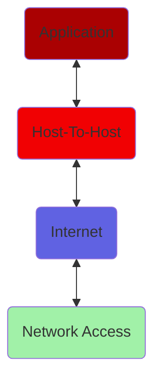
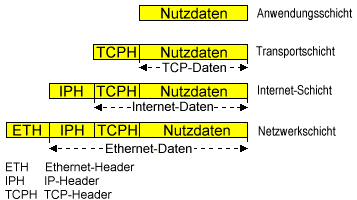

# TCP/IP

## 

## Schichtsache(n)

## TCP/IP en detail

### <a name="transport">Transport</a>

[SEE:](https://de.wikipedia.org/wiki/Transmission_Control_Protocol)

--> will hier erklärt werden wollen

## <a name="socket">Socket</a>

- <em>Eindeutiger Endpunkt</em> einer Kommunikation -  Verbindung von <var>IP-Adresse</var> und <var>Port</var>, sowie Protokoll (<var>UDP</var>, <var>TCP</var>)

Beispiele:
    - <kbd>192.168.23.42</kbd> : <kbd>443</kbd> <var>TCP</var> (HTTPS via TCP auf diese IP-Adresse )
    - <kbd>192.168.66.6</kbd> : <kbd>22</kbd> <var>TCP</var> (SSH via TCP auf diese IP-Adresse )